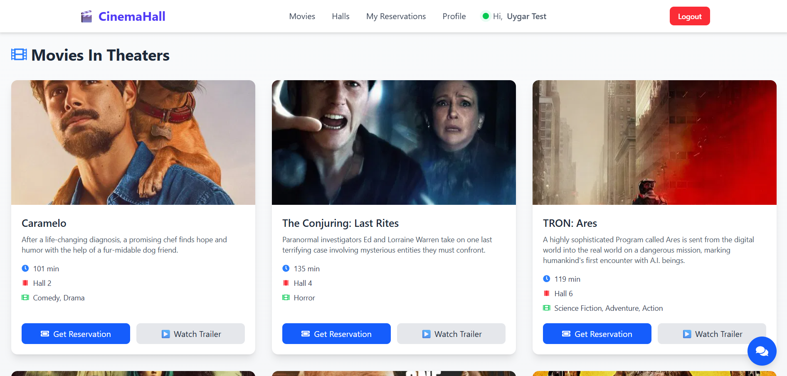
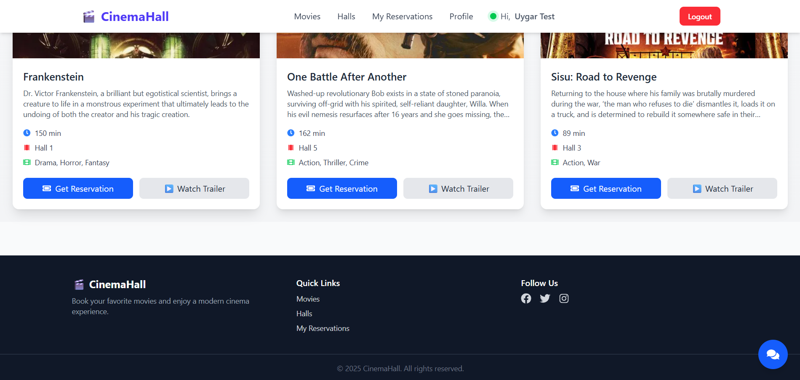
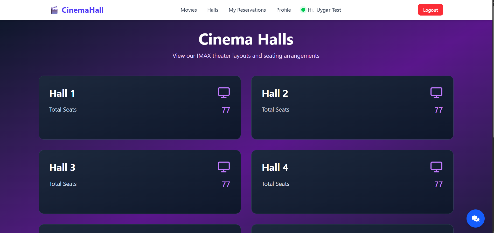
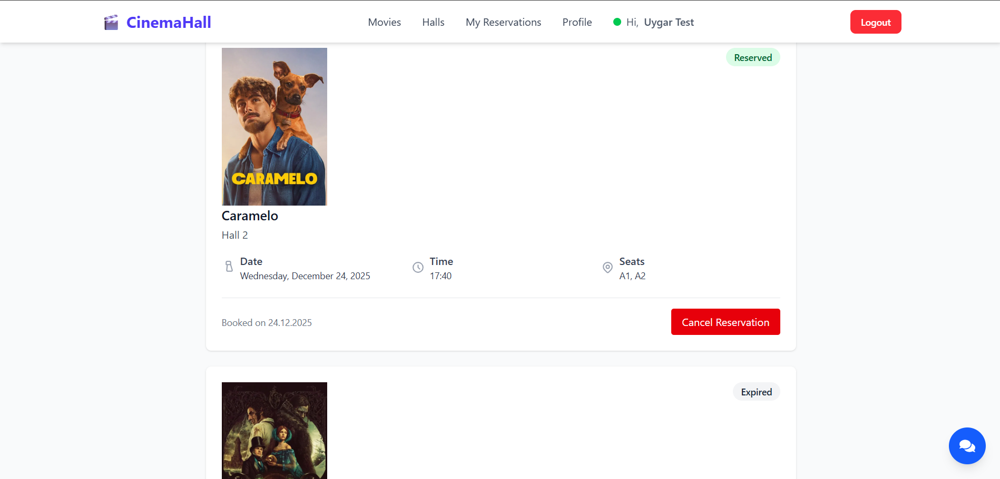
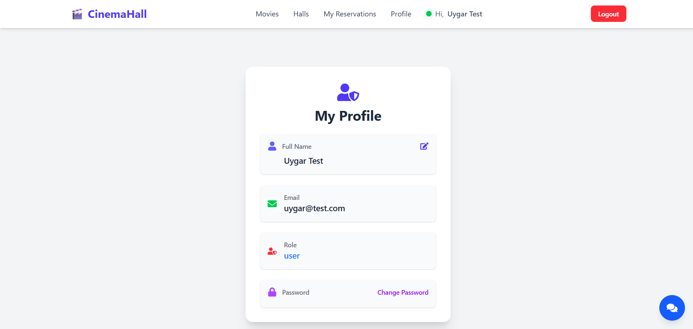
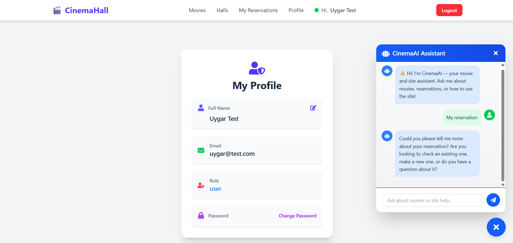
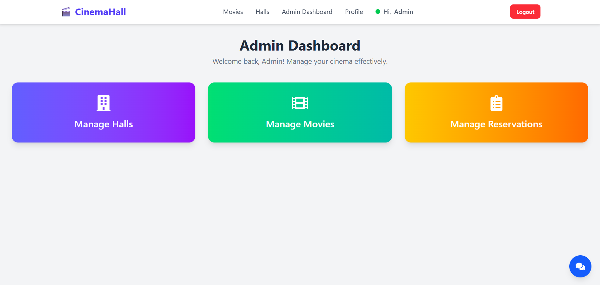

  

  <h1 align="center">CinemaHall Reservation System</h1>

  

    <strong>A Next-Generation Cinema Experience powered by AI</strong>
  

  

    <a href="#features">View Features</a> •
    <a href="#tech-stack">Tech Stack</a> •
    <a href="#screenshots">Screenshots</a>
  

  
  

 

## 📖 About The Project

**CinemaHall** is a comprehensive full-stack web application designed to modernize the traditional movie ticket booking process. Built on the robust **MERN architecture**, it provides a seamless interface for users to discover movies, visualize seating arrangements, and manage their entertainment schedules.

What sets this project apart is its integrated **Intelligent AI Assistant**. Unlike standard booking sites, CinemaHall features a context-aware chatbot that guides users through the site, provides real-time movie details, and assists with reservation queries, mimicking a human concierge experience.

---

## ✨ Key Features

### 🤖 AI-Powered Concierge
* **Smart Assistance:** Users can chat with an AI to get instant answers about movie plots, cast details, or site navigation.
* **Contextual Help:** The AI understands the site structure (Sitemap) and can direct users to specific pages or explain how to reserve a ticket.

### 👤 For Movie Goers
* **Interactive Hall Map:** A visual seat selection interface allowing users to choose their exact spot in the theater.
* **Real-Time Reservation:** Instant booking system with immediate status updates.
* **Ticket Wallet:** A dedicated history section to view past and upcoming movie tickets.
* **Secure Authentication:** Fully protected user profiles for managing credentials and personal data.

### 🛡️ For Administrators
* **Dynamic Hall Management:** Create and configure cinema halls with custom seating layouts.
* **Movie Database Control:** Add "Now Showing" movies, update showtimes, and manage metadata.
* **Reservation Oversight:** A centralized dashboard to view and manage all active bookings across the platform.

---

## 💻 Tech Stack

This project leverages the power of the **MERN** stack to ensure scalability and performance.

| Component | Technology | Description |
| :--- | :--- | :--- |
| **Frontend** |  | Dynamic user interface and state management. |
| **Backend** |  | Scalable server-side logic. |
| **Database** |  | Flexible NoSQL database for movies and users. |
| **API** |  | RESTful API structure. |
| **AI Integration** |  | LLM integration for the chat assistant. |

---

## 📸 Screenshots

  
  
    
  
  
    
  
  
    
  

